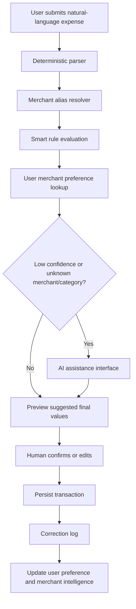

# Merchant Intelligence + Personalization

This layer turns confirmed expense data into reusable financial intelligence while keeping the deterministic parser as the primary decision maker. AI assistance is a gated fallback only; it never persists a transaction directly.

## Modules

- `merchants`: canonical merchant entities, aliases, normalization, and merchant-level intelligence.
- `personalization`: correction logging, user merchant preferences, and parse-time personalization.
- `rules`: user-owned smart auto-rules with deterministic priority evaluation.
- `subscriptions`: recurring transaction detection using cadence and amount-stability heuristics.
- `analytics`: merchant insights for top merchants, spend/frequency trends, confidence, and correction signals.
- `ai-assistance`: provider abstraction, confidence gating, retry, and cost-control boundary.

## Data Model

Key entities:

- `Merchant`: canonical name, normalized name, category tendencies, recurring likelihood, transaction count, confidence, metadata.
- `MerchantAlias`: normalized aliases such as `mcd`, `mcdonald`, or `mc donalds` mapped to canonical merchants.
- `UserMerchantPreference`: per-user category preference for a merchant.
- `TransactionCorrection`: audit log of parser prediction vs user-confirmed merchant/category.
- `SmartRule`: deterministic user rule, for example `IF merchant = Starbucks THEN category = Business Expense`.
- `UserSubscriptionInsight`: cache-ready table for eventual background materialization of subscription insights.

`Transaction` now stores parser-output snapshots:

- `parserAmount`
- `parserCurrency`
- `parserMerchantName`
- `parserCategory`
- `parserMissingFields`
- `merchantId`

This keeps final financial truth separate from parser output and makes every learning decision auditable.

## Event Flow



## API Contracts

### `GET /api/v1/merchants/lookup?name=mcd`

```json
{
  "success": true,
  "data": {
    "merchantId": "merchant_123",
    "canonicalName": "McDonald's",
    "normalizedName": "mcdonalds",
    "confidence": 0.94,
    "source": "ALIAS"
  }
}
```

### `POST /api/v1/rules`

```json
{
  "merchantName": "Starbucks",
  "category": "FOOD_DRINK",
  "priority": 50
}
```

### `GET /api/v1/subscriptions`

```json
{
  "success": true,
  "data": [
    {
      "merchant": { "id": "merchant_netflix", "name": "Netflix" },
      "currency": "USD",
      "estimatedMonthlyCost": 15.99,
      "nextExpectedCharge": "2026-06-21T00:00:00.000Z",
      "recurrenceConfidence": 0.91,
      "cadenceDays": 30,
      "transactionCount": 6,
      "lastSeenAt": "2026-05-21T00:00:00.000Z"
    }
  ]
}
```

### `GET /api/v1/analytics/merchant-insights`

```json
{
  "success": true,
  "data": [
    {
      "merchant": { "id": "merchant_123", "name": "Starbucks" },
      "totalSpend": 220.5,
      "averageSpend": 7.35,
      "frequency": 30,
      "latestTransactionDate": "2026-05-21T00:00:00.000Z",
      "monthlyChangePercent": 12.4,
      "confidenceInsights": {
        "averageParserConfidence": 0.86,
        "correctionCount": 3,
        "personalized": true
      }
    }
  ]
}
```

## Learning Rules

When a user confirms or edits a transaction:

1. Resolve the final merchant into a canonical `Merchant`.
2. Store parser output on the transaction for auditability.
3. Write `TransactionCorrection` rows when merchant/category differ.
4. Upsert `UserMerchantPreference` for category corrections.
5. Add the final merchant string as a high-confidence alias.
6. Increment merchant category tendencies and transaction count.

Parse-time priority order:

1. Deterministic parser output.
2. Merchant alias canonicalization.
3. User smart rule.
4. User merchant preference.
5. AI assistance only if confidence is low or merchant/category is unknown.

## Scalability

Indexes:

- `transactions(userId, transactionDate DESC)`
- `transactions(userId, merchantId, transactionDate DESC)`
- `merchant_aliases(normalizedAlias)`
- `user_merchant_preferences(userId, merchantId)`
- `smart_rules(userId, isActive, priority)`
- `transaction_corrections(userId, createdAt DESC)`

Background jobs:

- Refresh subscription insights nightly or after N new transactions per user.
- Recompute merchant category tendencies asynchronously for high-volume tenants.
- Queue merchant alias merge suggestions for admin review.
- Future OCR/bank imports should emit `transaction.confirmed` events into the same learning pipeline.

Caching:

- Cache merchant alias lookups by normalized alias.
- Cache active rules per user.
- Cache user merchant preferences by `userId:merchantId`.
- Materialize merchant insights for large tenants with eventual consistency.

Future embeddings/vector search:

- Add merchant embedding rows keyed by `merchantId`.
- Use vector search only for ambiguous alias suggestions, never as the sole persisted truth.
- Store provider, model, input hash, and confidence for AI auditability.

## Product Rationale

This creates SaaS retention because the product gets faster and more accurate the more a user corrects it. Correction data compounds into proprietary personalization: two users can share the same merchant entity while still receiving different category suggestions. Merchant intelligence also unlocks subscription monitoring, spend drift alerts, merchant benchmarking, and import/OCR normalization without rewriting the parser core.
